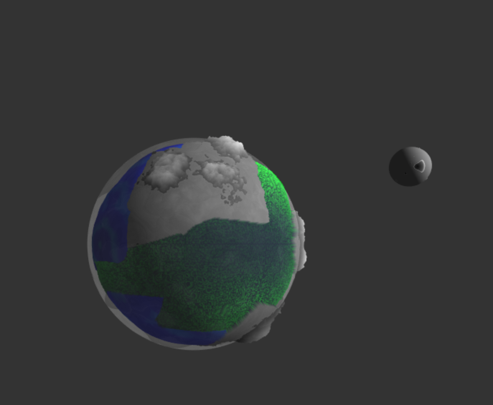
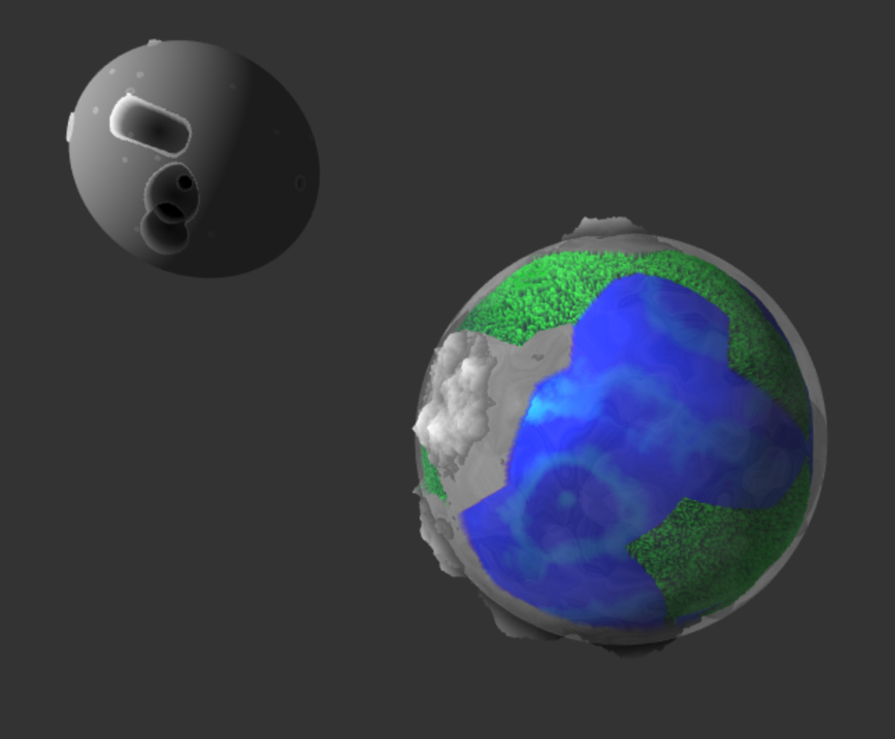
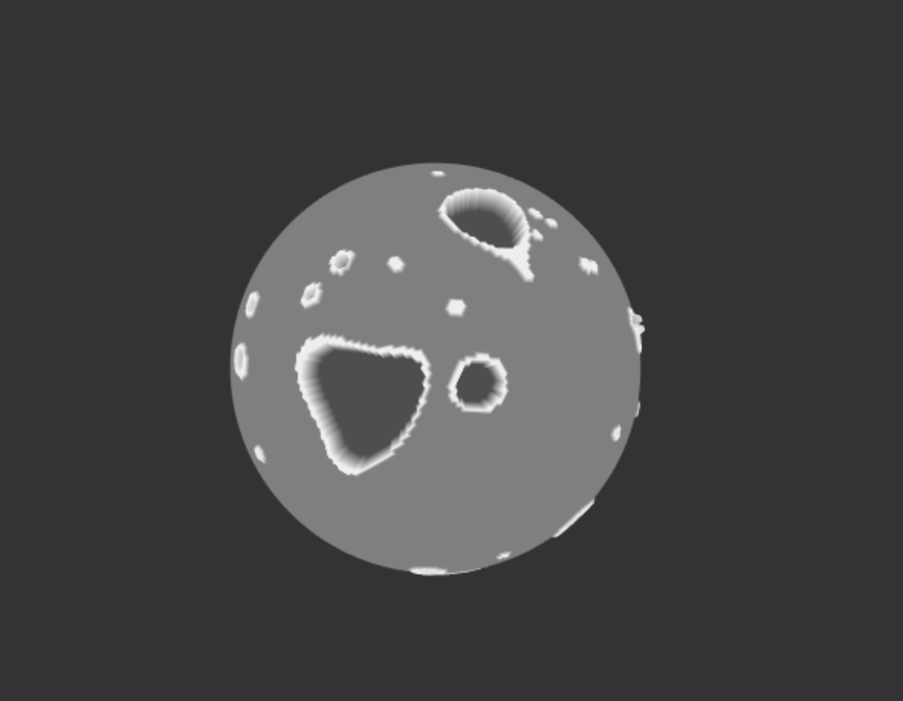

# CIS 566 Project 1: Noisy Planets

Name: Chloe Snyder
Pennkey: csny

github.io demo: https://chloesnyder.github.io/homework-1-noisy-planets-chloesnyder/

For reference, here is a planet made by your TA Dan last year for this
assignment:

##External Resources
Exact usages are cited in code comments
- [Curl Noise](https://petewerner.blogspot.com/2015/02/intro-to-curl-noise.html)
- [GPU Gems Chapter on Perlin Noise](http://developer.download.nvidia.com/books/HTML/gpugems/gpugems_ch05.html)
- [Worley Noise Implementations](https://thebookofshaders.com/12/)
-[Some noise functions taken from/modified from shadertoy](https://www.shadertoy.com/view/4dS3Wd)
-[Value noise](http://www.iquilezles.org/www/articles/morenoise/morenoise.htm)
-[Modified an FBM from here](https://shaderfrog.com/app/editor)
-[RGB Color picker](https://www.rapidtables.com/web/color/RGB_Color.html)

## Submission
Commit and push to Github, then submit a link to your commit on Canvas.

For this assignment, and for all future assignments, modify this README file
so that it contains the following information:
- Your name and PennKey
- Citation of any external resources you found helpful when implementing this
assignment.
- A link to your live github.io demo (we'll talk about how to get this set up
in class some time before the assignment is due)
- At least one screenshot of your planet
- An explanation of the techniques you used to generate your planet features.
Please be as detailed as you can; not only will this help you explain your work
to recruiters, but it helps us understand your project when we grade it!

## Extra Credit
- Use a 4D noise function to modify the terrain over time, where time is the
fourth dimension that is updated each frame. A 3D function will work, too, but
the change in noise will look more "directional" than if you use 4D.
- Use music to animate aspects of your planet's terrain (e.g. mountain height,
  brightness of emissive areas, water levels, etc.)
- Create a background for your planet using a raytraced sky box that includes
things like the sun, stars, or even nebulae.
